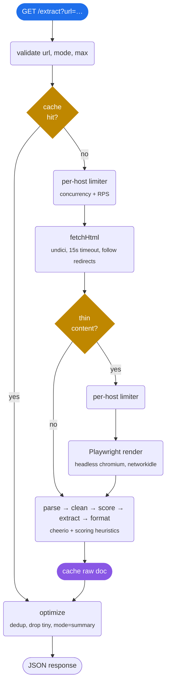

# FastParse

[](https://github.com/Raccoon254/fastparse/actions/workflows/test.yml)

A small HTTP service that fetches a web page and gives you back the actual content as JSON. No nav bars, no cookie banners, no footers — just the title, the headings, and the text underneath them.

It exists because feeding raw HTML (or even the raw text of a page) to an LLM is wasteful and noisy. fastparse is the layer in between.

Status: works on most static pages, SPAs (via Playwright), and emits both structured JSON and clean markdown.

## Usage

```bash
git clone git@github.com:Raccoon254/fastparse.git
cd fastparse
npm install
npm run dev
```

Then hit it:

```bash
curl "http://127.0.0.1:3000/extract?url=https://en.wikipedia.org/wiki/Web_scraping"
```

You get back something like:

```json
{
  "title": "Web scraping - Wikipedia",
  "url": "https://en.wikipedia.org/wiki/Web_scraping",
  "sections": [
    { "heading": "History",    "content": "After the birth of the World Wide Web in 1989..." },
    { "heading": "Techniques", "content": "..." }
  ],
  "metadata": {
    "word_count": 3929,
    "section_count": 19,
    "extracted_at": "2026-04-09T10:12:15.236Z",
    "mode": "full",
    "format": "json"
  }
}
```

Want markdown for an LLM prompt instead? Add `?format=markdown`:

```bash
curl "http://127.0.0.1:3000/extract?url=https://en.wikipedia.org/wiki/Web_scraping&format=markdown"
```

```json
{
  "title": "Web scraping - Wikipedia",
  "url": "https://en.wikipedia.org/wiki/Web_scraping",
  "content": "# Web scraping\n\n## History\n\nAfter the birth of the World Wide Web in 1989...\n\n## Techniques\n\n...",
  "metadata": {
    "word_count": 3929,
    "section_count": 19,
    "extracted_at": "2026-04-09T10:12:15.236Z",
    "mode": "full",
    "format": "markdown"
  }
}
```

Inline formatting (links, lists, bold, code blocks) is preserved in the markdown output, and relative URLs are resolved against the page's final URL so the markdown stays useful when the source disappears.

There's also `GET /health` for liveness, `?fresh=1` to bypass the cache, an `x-fastparse-cache: hit|miss` response header, and `?mode=summary&max=N` to keep only the top-N longest sections.

```bash
# Full document
curl "http://127.0.0.1:3000/extract?url=https://example.com/long-article"

# Just the 3 longest sections, deduped
curl "http://127.0.0.1:3000/extract?url=https://example.com/long-article&mode=summary&max=3"

# Markdown summary, top 3 sections
curl "http://127.0.0.1:3000/extract?url=https://example.com/long-article&format=markdown&mode=summary&max=3"
```

Successive requests for the same URL serve from cache regardless of `?format` or `?mode` — the chosen content container is cached once and re-rendered into JSON or markdown on each response.

## How it works



The same flow in plain text:

```
GET /extract?url=…
    │
    ▼
validate url + opts
    │
    ▼
cache hit? ───── yes ─────┐
    │ no                  │
    ▼                     │
per-host limiter          │
    │                     │
    ▼                     │
fetchHtml (undici)        │
    │                     │
    ▼                     │
thin content?             │
    │ no    │ yes         │
    │       ▼             │
    │   per-host limiter  │
    │       │             │
    │       ▼             │
    │   Playwright render │
    │       │             │
    ▼       ▼             │
parse → clean → score     │
  → extract → format      │
    │                     │
    ▼                     │
cache.set(url, rawDoc)    │
    │                     │
    ▼                     ▼
    optimize(doc, mode)
    │
    ▼
JSON response
```

1. **cache** is checked first. Hits are returned immediately. `?fresh=1` skips it. (LRU, 500 entries, 10 min TTL by default.)
2. **per-host limit** wraps every fetch and render call in a token-bucket + concurrency cap, scoped to `parsedUrl.host`. Defaults: 4 concurrent in-flight requests and 4 RPS per host. Different hosts never block each other.
3. **fetch** grabs the HTML over `undici` with a 15s timeout and follows redirects.
4. **thin?** If the fetched HTML looks like an SPA shell — under 500 chars of real text, or contains an "enable JavaScript" message — fastparse hands off to the renderer (also under the host limit).
5. **render** launches a shared headless chromium via Playwright, navigates to the URL with `waitUntil: networkidle`, and grabs `page.content()`. The browser is launched once and reused. If Playwright isn't installed, this step is skipped and you get whatever the original fetch returned.
6. **parse** loads the HTML into cheerio and rips out the obvious junk: scripts, styles, nav, footer, aside, forms, share buttons, cookie banners, anything matching `[role="navigation"]` or `[class*="cookie"]`, etc.
7. **score** walks every block-ish node and gives it points for text length, paragraph count, and prose-y signals (commas), and takes points away for link density and bad class/id hints (`sidebar`, `comments`, `promo`, …). `<article>` and `<main>` get a head start.
8. **extract** picks the highest scorer. There's a fast path: if the page has a meaty `<article>` or `<main>`, it just uses that.
9. **format** walks the winner in document order, splits on `h1-h6`, and emits a `{heading, content}[]` array. This raw document is cached.
10. **optimize** runs on every response: drops headingless sub-5-word fragments, dedupes paragraphs across the whole document (case-and-punctuation-insensitive), and in `summary` mode keeps the longest N sections in original order. The cache key is just the URL, so swapping `?mode` or `?format` is free.
11. **format** emits the final shape: JSON `{title, url, sections, metadata}` by default, or markdown `{title, url, content, metadata}` when `?format=markdown`. Markdown goes through turndown for inline formatting (links, lists, bold, code) and resolves relative URLs against the page's final URL.

That's the whole engine. Each step is one file under `src/`.

## Project layout

```
src/
  fetch/    undici GET, AbortController timeout, content-type guard
  render/   thin-content detector + Playwright renderer (lazy)
  cache/    LRU wrapper (lru-cache)
  limit/    per-host concurrency + token-bucket rate limit
  parse/    cheerio load + noise stripping, title resolution
  score/    node scoring heuristics
  extract/  pick the winning container
  format/   walk the container into sections + markdown via turndown
  optimize/ dedup, drop tiny sections, summary mode (json + markdown)
  api/      Fastify server
  index.js  boot the server
```

## SPA support

The renderer is opt-in by virtue of having Playwright installed:

```bash
npm install playwright
npx playwright install chromium
```

After that, fastparse will automatically use chromium for any page whose
fetched HTML is too thin to extract from. There's an end-to-end test under
`test/e2e/spa.test.js` that proves this against a local SPA fixture: an
HTML shell with an empty `<div id="root"></div>` that only fills in
content via JS. Without the renderer, fastparse extracts nothing useful;
with it, the rendered article comes out cleanly.

## Tests

```bash
npm test                  # unit + integration
npm run test:unit         # pure functions and small mocks, no network
npm run test:integration  # spins up local HTTP servers + Fastify inject()
npm run test:e2e          # real Playwright against a local SPA fixture
npm run test:coverage     # unit + integration with V8 coverage, gated at 100%
```

125 unit + integration tests, 2 e2e, 100% line / branch / function coverage on `src/`. CI runs lint → unit → integration → coverage gate + e2e (Playwright) + smoke (real HTTP boot) on Node 20 and 22.

## What's not here yet

- **Intent extraction** (`?intent=pricing`). The plumbing isn't there yet.
- **Persistent cache.** Right now it's in-process LRU only.
- **Per-host limits exposed as HTTP headers.** Stats are tracked internally but not yet returned.

## Stack

Node 20+, Fastify 5, undici 8, cheerio 1, lru-cache 11, turndown 7. Playwright is an optional dev dep used by the SPA renderer. ESM, no build step.

## License

MIT.
